# Konfigurasi Bind9

## 1. Install Bind9

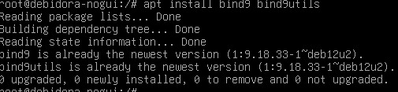

##

## 2. Setting Konfigurasi (untuk domain `kelompok7.com`) pada file-file berikut

### Pada `/etc/bind/named.conf`

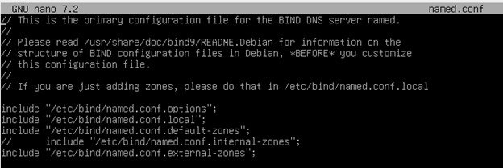

---

### Pada `/etc/bind/named.conf.options`

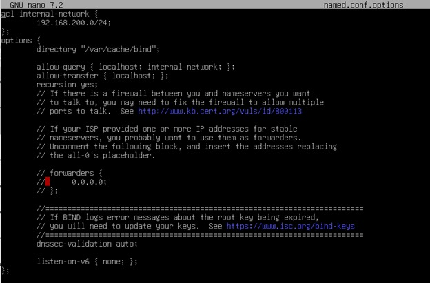

---

### Pada `/etc/bind/named.conf.external-zones`

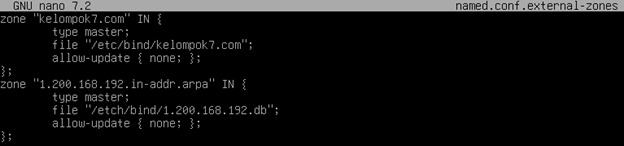

**Fungsi:**  
Mendefinisikan zona DNS untuk domain `com` dan zona reverse DNS.

---

### Pada `/etc/bind/kelompok7.com`

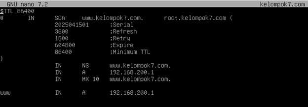

---

### Pada `/etc/bind/1.200.168.192.db`

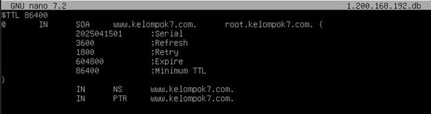

**Fungsi:**  
Menerjemahkan alamat IP menjadi nama domain (reverse lookup).

---

## 3. Setting Resolver agar Menggunakan DNS Server Debian Student

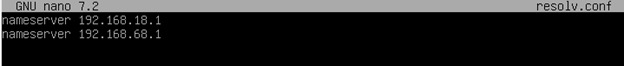

## 4. Hasil

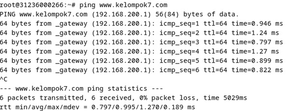
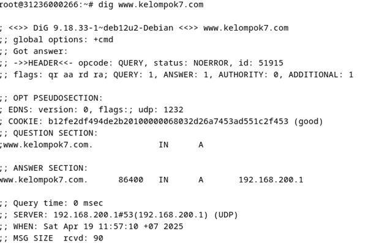

---

## 5. Setting Iptables

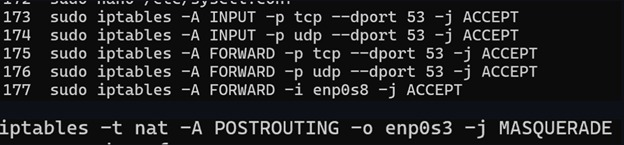

**Penjelasan:**

- Izinkan koneksi masuk ke port **53** (DNS) via:
  - TCP (`-p tcp`)
  - UDP (`-p udp`)  
    Port 53 dipakai oleh DNS, dan biasanya pakai UDP, tapi juga bisa pakai TCP untuk transfer data besar (misalnya zone transfer).

**Artinya:**  
Server ini bisa menerima permintaan DNS.

- **NAT**: Mengatur IP masquerading untuk trafik keluar lewat interface `enp0s8`.  
  Artinya: Semua trafik dari LAN (yang diforward) akan disamarkan menggunakan IP publik `enp0s8`.

**Hasil:**

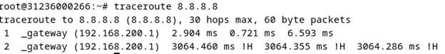
